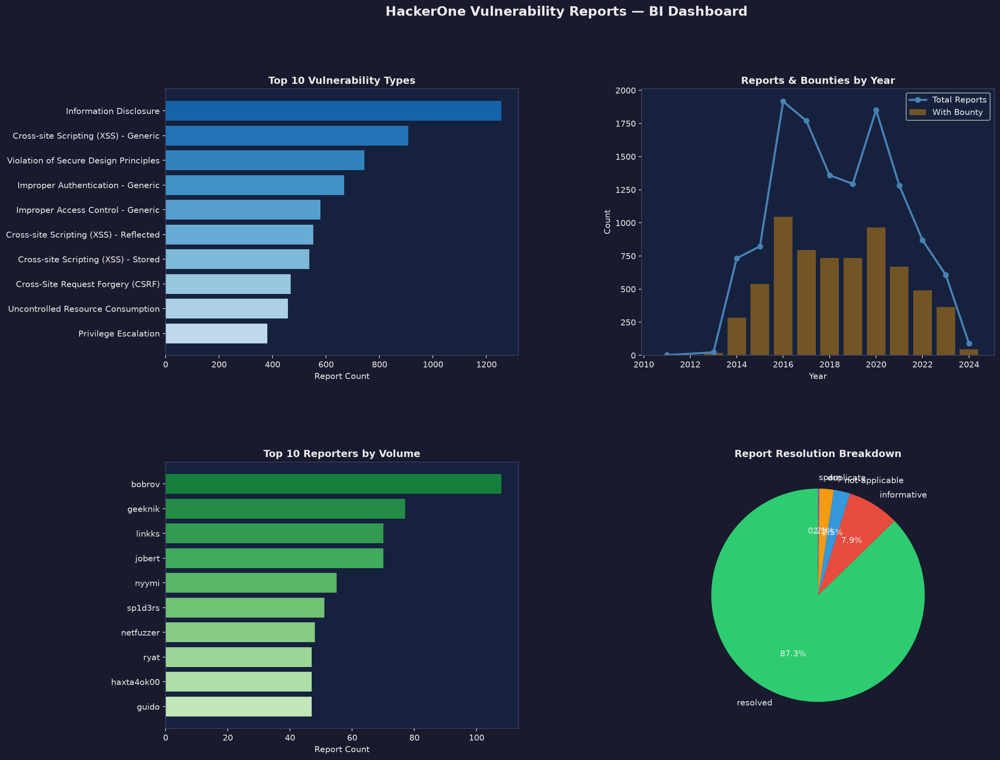

# End-to-End Data Engineering Pipeline with DuckDB & Python

A fully local data engineering pipeline built inside a single Jupyter notebook, following the **Medallion Architecture** (Bronze → Silver → Gold). It ingests real-world vulnerability disclosure data, models it into a star schema using DuckDB, validates it with an automated QA layer, and produces a BI-ready analytics dashboard — all with no cloud infrastructure or costs.

---

## Dashboard



---

## Architecture

```
HuggingFace Dataset (Hacker0x01/disclosed_reports)
        │
        ▼
┌──────────────────────────────────────────────┐
│  BRONZE  →  Raw data, minimal preprocessing  │
│            Saved as Parquet (12,618 rows)    │
└──────────────────────────────────────────────┘
        │
        ▼
┌──────────────────────────────────────────────┐
│  SILVER  →  Flatten JSON, type cast, clean   │
│            nulls, deduplicate (16 columns)   │
└──────────────────────────────────────────────┘
        │
        ▼
┌──────────────────────────────────────────────┐
│  GOLD    →  Star schema (DuckDB SQL)         │
│            fact_reports + 4 dimensions       │
│            MD5 surrogate keys                │
└──────────────────────────────────────────────┘
        │
        ▼
┌──────────────────────────────────────────────┐
│  QA      →  22 automated checks              │
│            (nulls, dupes, FK integrity)      │
└──────────────────────────────────────────────┘
        │
        ▼
┌──────────────────────────────────────────────┐
│  BI MARTS →  Aggregated views + dashboard    │
└──────────────────────────────────────────────┘
```

---

## Tech Stack

| Purpose | Technology |
|---|---|
| Data ingestion | HuggingFace `datasets`, Pandas |
| Storage format | Parquet |
| Transformation & modeling | DuckDB (in-process SQL) |
| Data quality | Custom Python QA layer |
| Visualization | Matplotlib |
| Environment | Jupyter Notebook (VS Code) |

---

## Star Schema

```
            dim_reporter
                 │
dim_date ─── fact_reports ─── dim_team
                 │
            dim_weakness
```

| Table | Rows | Description |
|---|---|---|
| `fact_reports` | 12,618 | One row per vulnerability report (votes, bounty, dates, FKs) |
| `dim_reporter` | 4,485 | Reporter username, name, reputation |
| `dim_team` | 360 | Team/program handle and name |
| `dim_weakness` | 163 | Vulnerability type and external ID |
| `dim_date` | 3,330 | Date breakdown (year, month, quarter, day of week) |

---

## Key Features

### Medallion Architecture
Each layer is persisted separately as Parquet, so any stage can be re-run independently and raw data is always recoverable.

### Surrogate Keys via MD5 Hashing
Dimension keys are generated by hashing natural keys (`md5(reporter_username)`, `md5(weakness_name)`). This guarantees stable, consistent join keys while obscuring sensitive identifiers like usernames.

### Automated QA Layer
22 automated checks run after the Gold layer is built, covering:
- **Row count** consistency across layers
- **Null checks** on primary and foreign keys
- **Duplicate checks** on dimension keys
- **Referential integrity** — every fact-table foreign key must exist in its dimension
- **Business logic** — non-negative votes, sane disclosure timeframes, valid status values

All 22 checks pass on the current dataset.

### DuckDB SQL Modeling
The entire star schema is built using DuckDB SQL queries running directly on Pandas DataFrames — no database server required.

---

## Insights from the Dashboard

- **Information Disclosure** is the most frequently reported vulnerability type
- **2016** was the peak year for disclosures, with a second peak in **2020**
- A small group of **power reporters** account for a large share of submissions
- **~87%** of all reports reach a resolved status

---

## Project Structure

```
duckdb-pipeline-project/
├── pipeline.ipynb              # Full end-to-end pipeline notebook
├── hackerone_dashboard.png     # Final BI dashboard
├── requirements.txt            # Python dependencies
├── .gitignore
└── README.md
```

> Note: Parquet data files and the DuckDB database are generated when the notebook runs and are excluded from version control via `.gitignore`.

## Pipeline Phases

| Phase | What it does |
|---|---|
| 1. Ingestion | Downloads 3 dataset splits from HuggingFace, combines into one DataFrame |
| 2. Bronze | Parses dates, serializes nested JSON, saves raw Parquet |
| 3. Silver | Flattens JSON columns, casts types, fills nulls, deduplicates |
| 4. Gold | Builds star schema with DuckDB + MD5 surrogate keys |
| 5. QA | Runs 22 automated data quality checks |
| 6. BI Marts | Aggregates Gold tables into analytics views + dashboard |

---

## Key Concepts Demonstrated

- **Medallion Architecture** (Bronze/Silver/Gold)
- **Star schema modeling** (fact + dimension tables)
- **Surrogate key generation** via MD5 hashing
- **Automated data quality / QA testing**
- **Referential integrity** validation
- **In-process analytical SQL** with DuckDB
- **Semi-structured data handling** (nested JSON flattening)

---

## Source Data

[HackerOne Disclosed Reports](https://huggingface.co/datasets/Hacker0x01/disclosed_reports) — a public dataset of disclosed vulnerability reports from the HackerOne bug bounty platform, containing 12,618 records across reporter, team, weakness, and report metadata.